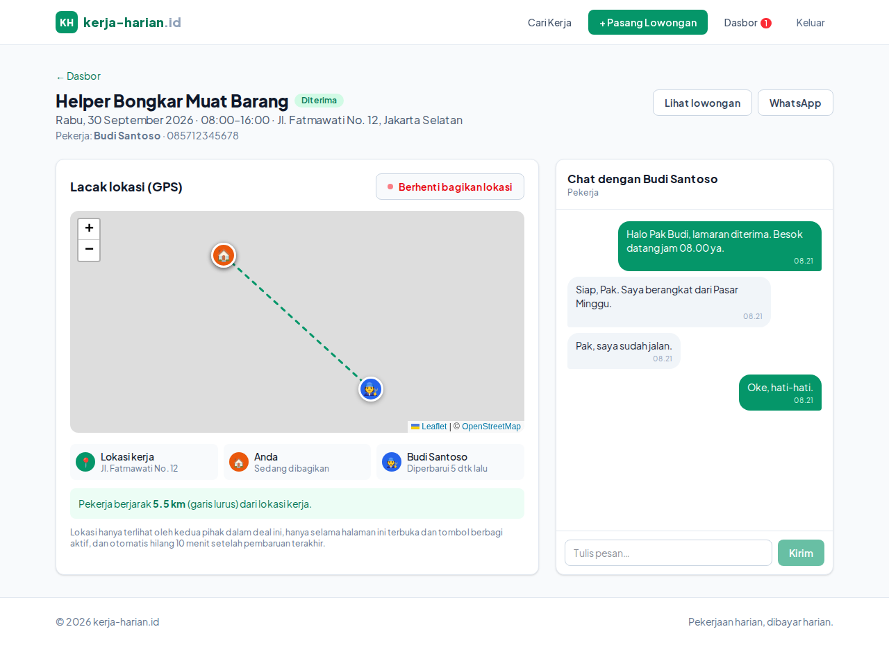
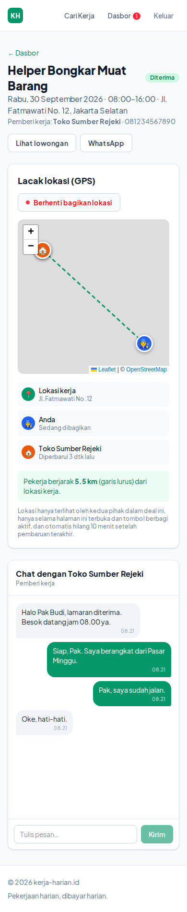

# kerja-harian.id — versi web

Marketplace kerja harian: mempertemukan **pemberi kerja** dengan **pekerja harian lepas**.

## Fitur

- **Cari lowongan** dengan filter kata kunci, kategori, dan kota.
- **Akun pekerja**: daftar, lamar pekerjaan (dengan pesan), pantau status lamaran, batalkan lamaran.
- **Akun pemberi kerja**: pasang lowongan (upah per hari/jam/proyek, tanggal, jam kerja, jumlah orang),
  terima/tolak pelamar, hubungi pelamar via WhatsApp, buka/tutup lowongan.
- Profil pengguna (nama, nomor HP/WA, kota, bio).
- **Chat** pekerja ↔ pemberi kerja per lamaran (sejak melamar, ditutup bila ditolak), dengan penanda pesan
  belum dibaca di header & dasbor.
- **Lacak lokasi GPS setelah deal** (lamaran diterima): kedua pihak dapat membagikan lokasi live dari browser,
  terlihat di peta bersama titik lokasi kerja dan jarak pekerja ke lokasi. Titik lokasi kerja dipilih di peta
  saat memasang lowongan.
- **Rating & ulasan dua arah** (1–5 bintang + komentar) setelah hari kerja, tampil di daftar pelamar,
  halaman lowongan, dan profil.
- **Profil publik** (`/profil/[id]`): foto profil, hingga 3 foto portofolio, tautan Instagram/Facebook,
  lencana terverifikasi, jumlah pekerjaan selesai, dan daftar ulasan. Foto dikompres di browser dan disimpan
  di database (tanpa layanan storage tambahan).
- **Verifikasi email** gratis via Resend (opsional, lihat `docs/DEPLOY.md`).

## Teknologi

- [Next.js 16](https://nextjs.org) (App Router, Server Components, Server Actions) + TypeScript
- Tailwind CSS v4
- Database libSQL/SQLite: file lokal saat pengembangan, [Turso](https://turso.tech) di produksi (Vercel)
- Autentikasi sesi berbasis cookie httpOnly, kata sandi di-hash dengan scrypt
- Peta: [Leaflet](https://leafletjs.com) + tile OpenStreetMap; GPS lewat Geolocation API browser
- Chat & lokasi live memakai polling tiap 3 detik ke `/api/deal/[id]/sync`

## Menjalankan secara lokal

Butuh Node.js ≥ 20.

```bash
npm install
npm run dev
```

Buka http://localhost:3000. Database dibuat otomatis di `data/kerjaharian.db` (atau Turso bila `TURSO_DATABASE_URL` diisi, lihat
`.env.example`) dan diisi data demo:

| Email           | Peran          | Kata sandi |
| --------------- | -------------- | ---------- |
| `toko@demo.id`  | Pemberi kerja  | `demo1234` |
| `event@demo.id` | Pemberi kerja  | `demo1234` |
| `budi@demo.id`  | Pekerja        | `demo1234` |

## Struktur

```
src/
  app/
    page.tsx               Beranda
    lowongan/              Daftar, detail ([id]), dan pasang lowongan (baru)
    masuk/, daftar/        Login & registrasi
    dasbor/                Dasbor pekerja / pemberi kerja + profil
    deal/[id]/             Ruang chat + lacak lokasi untuk satu lamaran
    api/deal/[id]/         API polling, kirim pesan, perbarui/hapus lokasi
  components/              Header, kartu lowongan, form, dll.
  lib/
    db.ts                  Koneksi libSQL/Turso, skema, data demo
    auth.ts                Sesi & pengguna saat ini
    queries.ts             Query baca
    actions.ts             Server Actions (tulis)
    deal.ts                Chat, status baca, dan lokasi live
```

## Catatan GPS & privasi

- Browser hanya mengizinkan GPS di **HTTPS** atau `localhost`, jadi saat deploy pastikan memakai HTTPS.
- Lokasi hanya dibagikan saat pengguna menekan "Bagikan lokasi saya" dan halaman deal terbuka; lokasi terlihat
  hanya oleh dua pihak dalam deal, dan dianggap kedaluwarsa 10 menit setelah pembaruan terakhir.
- Lokasi dihapus otomatis bila status lamaran berubah dari "diterima".
- Akun demo `budi@demo.id` sudah punya deal diterima dengan `toko@demo.id` untuk mencoba fitur ini.

## Deploy (Vercel + Turso + domain)

Panduan lengkap langkah demi langkah: **[docs/DEPLOY.md](docs/DEPLOY.md)**.

Ringkasnya: buat database di Turso, import repo ke Vercel dengan env `TURSO_DATABASE_URL` dan
`TURSO_AUTH_TOKEN`, lalu arahkan DNS `kerja-harian.id` di Domainesia ke Vercel. Di Vercel, data demo
tidak diisi kecuali `SEED_DEMO_DATA=1`.

## Tampilan

| Beranda | Detail lowongan |
| --- | --- |
|  |  |
| **Dasbor pemberi kerja** | **Beranda (mobile)** |
|  |  |
| **Chat & lacak lokasi** | **Chat & lacak lokasi (mobile)** |
|  |  |

Screenshot lain ada di [`docs/screenshots/`](docs/screenshots/).
