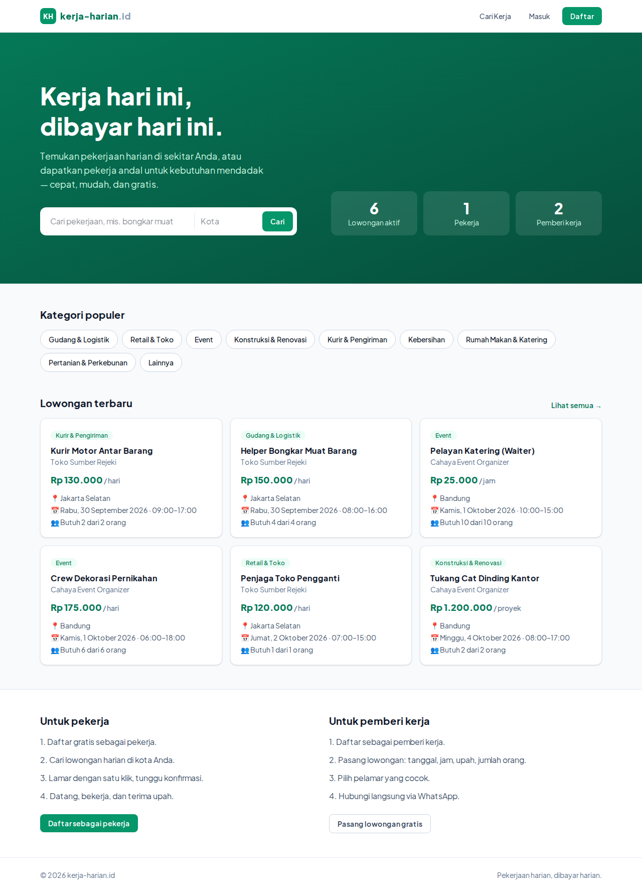
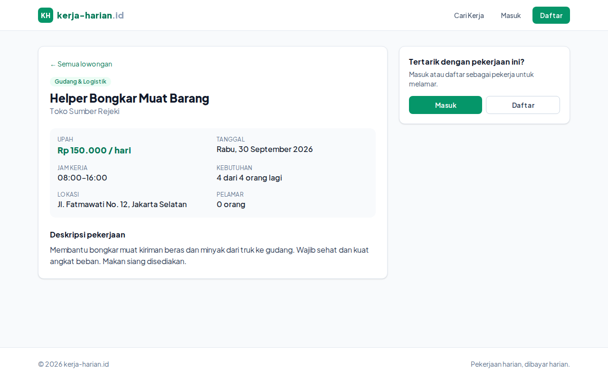
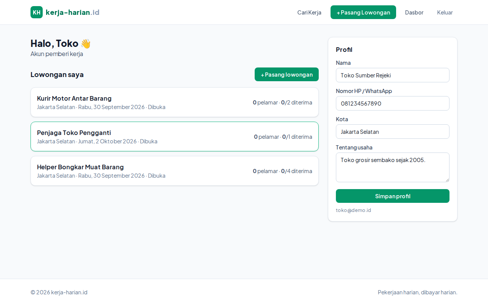
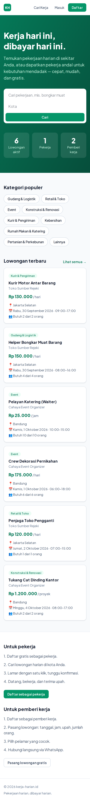

# kerja-harian.id — versi web

Marketplace kerja harian: mempertemukan **pemberi kerja** dengan **pekerja harian lepas**.

## Fitur

- **Cari lowongan** dengan filter kata kunci, kategori, dan kota.
- **Akun pekerja**: daftar, lamar pekerjaan (dengan pesan), pantau status lamaran, batalkan lamaran.
- **Akun pemberi kerja**: pasang lowongan (upah per hari/jam/proyek, tanggal, jam kerja, jumlah orang),
  terima/tolak pelamar, hubungi pelamar via WhatsApp, buka/tutup lowongan.
- Profil pengguna (nama, nomor HP/WA, kota, bio).

## Teknologi

- [Next.js 16](https://nextjs.org) (App Router, Server Components, Server Actions) + TypeScript
- Tailwind CSS v4
- SQLite bawaan Node.js (`node:sqlite`) — tanpa dependensi database tambahan
- Autentikasi sesi berbasis cookie httpOnly, kata sandi di-hash dengan scrypt

## Menjalankan secara lokal

Butuh Node.js ≥ 22.13.

```bash
npm install
npm run dev
```

Buka http://localhost:3000. Database dibuat otomatis di `data/kerjaharian.db` (ubah lewat env
`DATABASE_PATH`) dan diisi data demo:

| Email           | Peran          | Kata sandi |
| --------------- | -------------- | ---------- |
| `toko@demo.id`  | Pemberi kerja  | `demo1234` |
| `event@demo.id` | Pemberi kerja  | `demo1234` |
| `budi@demo.id`  | Pekerja        | `demo1234` |

## Struktur

```
src/
  app/
    page.tsx               Beranda
    lowongan/              Daftar, detail ([id]), dan pasang lowongan (baru)
    masuk/, daftar/        Login & registrasi
    dasbor/                Dasbor pekerja / pemberi kerja + profil
  components/              Header, kartu lowongan, form, dll.
  lib/
    db.ts                  Skema SQLite + data demo
    auth.ts                Sesi & pengguna saat ini
    queries.ts             Query baca
    actions.ts             Server Actions (tulis)
```

## Catatan deploy

SQLite menyimpan data di file lokal, jadi jalankan di server dengan disk persisten (VPS, Railway,
Fly.io dengan volume, dll.). Untuk platform serverless seperti Vercel, ganti `src/lib/db.ts` ke
database terkelola (mis. Postgres/Turso).

## Tampilan

| Beranda | Detail lowongan |
| --- | --- |
|  |  |
| **Dasbor pemberi kerja** | **Beranda (mobile)** |
|  |  |

Screenshot lain ada di [`docs/screenshots/`](docs/screenshots/).
